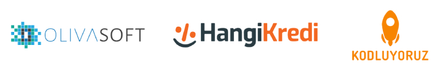
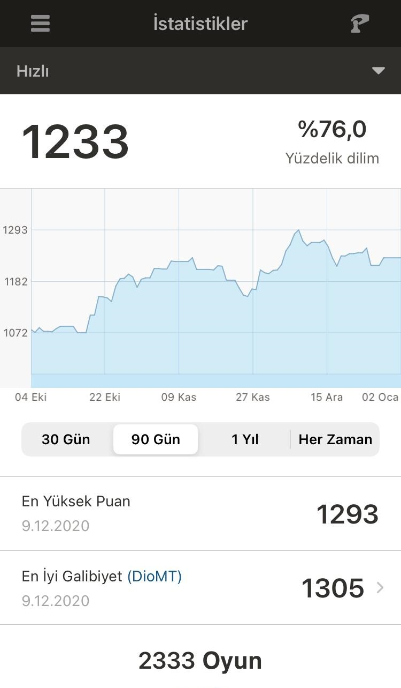
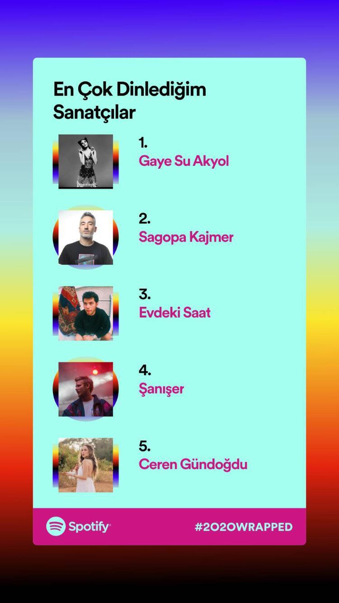

Her yıl gelenek haline getirdiğim biten yılın değerlendirmesi ve yeni yıl hedefleri makaleme bu senede devam ediyorum.

Blog sitemin teknik alt yapısını sürekli değiştirmemden ötürü bazı eski makalelerime maalesef ulaşamıyorum. En azından bundan sonrasının düzenli olacağını garanti edebilirim.

## 2020'nin Kısa Özeti

2020'yi tek kelime ile özetlemek gerekirse, tüm dünya adına ortak bir kelimemiz çıkacaktır; **korona**.

Çin'in Wuhan kentinden tüm dünyaya hızla yayılan ve hayatı felç eden COVID-19 virüsü herkesin planlarını bozdu. İlk zamanlarda her dışarıdan eve geldiğimizde uzun uzun el yıkamamız, gözlükleri buhar yapan ve nefes almayı zorlaştıran maskeler, arkadaş çevremizle görüşememek vb iyice bunalttı herkesi. Fakat ilerleyen zamanlarda artık maskeyede, virüsede alıştık.

Ben zaten evden pek çıkmayan birisi olduğum için başlarda bu yeni düzene alışmakta zorluk çekmedim; çünkü zaten mevcut yaşamım insanlardan ve sokaklardan uzak olduğu için hayatımda bir şey değişmemişti. Zamanla dışarı çıkamamak, arkadaşlarla ayda bir bile olsa kahve içememek beni bile bunalttı ve aralarda parklarda buluşup sohbet ettik.

Geniş pencereden baktığımızda 2020 yılı, dünya için bir çok felaketi barındırsada özel hayatımda oldukça güzel gelişmelere tanıklık etti. Bunları başlıklar altında topladım.

## Bilgisayar & Araba

Üniversite hazırlıkta satın aldığım ve yazılımda neredeyse her şeyimi öğrendiğim 8 yıllık MSI laptopumu elden çıkarttım. Her ne kadar içim el vermesede (hatıra olarak uzun yıllar saklamak isterdim), yeni alacağım bilgisayara bütçe oluşturabilmek için satmak zorunda kaldım.

Elimdeki bütçe ile son sistem bir oyun bilgisayarı topladım. Üst düzey performans almama rağmen, "*oyun oynamıyorum, neden böyle bir bilgisayar aldım?*" sorusu kafamı çok kurcaladı. Gün geçtikçe bu his, pişmanlığı arttırdı ve 6 ay kullandıktan sonra elden çıkarttım. Yeni yılda Macbook Pro almayı planlıyorum.

Bu yılın güzel geliştirmelerinden biriside araba almış olmam. Zerre arabalardan anlamazdım fakat elimdeki birikmiş, borsa ve ailemdeki eski aracı satıp, birazda kredilerle destekleyerek **Volkswagen Polo 1.6 TDI Comfortline** satın aldım.

## Borsa

Öğrencilik hayatımda birikim hiç yapmadım, zaten çok bir bütçemde yoktu. İş hayatım yavaştan düzene giriş para kazanmaya başlayınca altından daha hızlı kazanç sağlama ihtimali olan borsaya yöneldim. 4 arkadaş kolları sıvayıp, 0 tecrübe ile çeşitli hisselere girdik. Ben Tüpraş, Aselsan ve Esen hisselerine girdim.

Aylarca borsayı takip etmek, yorumları okumak kafayı yedirten bir süreç oldu. Sonucunda maalesef istediğimiz sonuçları alamadık ve zararla borsadan çıkma kararı aldım, uzun bir sürede tekrar bulaşmayı planlamıyorum.

## Drone Pilotluğu

İşime yarar mı bilmem ama Sivil Havacılık'tan drone pilotluğu sertifikası aldım.

## İş Hayatı

Yazılım hayatım bir süre ofis, bir süre freelance şeklinde gidip geliyordu. Freelance çalışmanın her ne kadar artıları olsa da, düzensiz gelir planlar kurmamı engelliyordu. Bu yüzden düzenli bir iş hayatı çizgisi çizmek ilk hedeflerimden birisiydi. Çok şükür aradığım güzel ortamı Hangikredi çatısı altında buldum. <a href="http://www.olivasoft.com/" target="_blank" rel="noopener noreferrer" >**Olivasoft**</a> firması ile el sıkışarak, danışman olarak Eylül itibariyle <a href="https://www.hangikredi.com/" target="_blank" rel="noopener noreferrer" >**Hangikredi**</a>'de çalışmaya başladım.

Pantemi yüzünden remote başladı ve 2020 sonuna kadar böyle devam etti. Yeni yılıda büyük ölçüde bu şekilde ilerletiriz gibi duruyor. Çok yoğun fakat verimli bir ilerleyiş ile yorgun bir şekilde yılı noktaladım.

Buna ek olarak <a href="https://www.kodluyoruz.org/bootcamp/kirikkale-front-end-web-gelistirme-101-bootcamp/" target="_blank" rel="noopener noreferrer" >**Kodluyoruz**</a> ekibi Ekim ayı itibariyle tarafıma Frontend eğitimi vermem için ulaştı. Aralık sonu itibariyle hafta sonu saat 10:00-15:00 arasında -*genelde 17:00'a kadar*- eğitim verdim. Sıfır seviyesinden HTML, CSS, SASS, BEM konularını anlatıp, Psd to CSS üzerinde durdum. Yeni yıl itibariyle Git, JavaScript ve React anlatarak eğitimi noktalayacağım.

Hafta içi iş, hafta sonu eğitim vermek yorgunluktan hasta etmiş olsa bile bu yoğunluk ve üretkenlik çok hoşuma gidiyor.

## Okul Hayatı

2012'de hazırlık okuluna başladığım yazılım mühendisliği bölümünde okul hayatım gerek umursamam, gerek iş hayatına öncelik vermem sebebiyle sürekli uzayıp durdu. En sonunda tek derse kadar indirdiğim eğitim hayatım pandeminin vurduğu zamanların başında "*hazır iş güç yok, bari okulu aradan çıkartayım*" diyerek çok şükür ki tamamladım, üzerimden büyük bir yük kalktı.

## Satranç

Son yıllarda hayatıma kattığım en güzel yeniliklerden birisi satranç olmuştu. 2019 yılında başladığım satrançta, düzenli oyun ve turnuva takipleri sayesinde oldukça ilerledim. Yılın başında en yüksek **1086 elo** (satranç puanım) olmuş ve yeni yıl hedef puanımı 1250 üstü olarak belirlemiştim. Puan ilerledikçe maçlar zorlanmaya başladığından bu hiçte kolay bir süreç olmuyor. 2020 sonu itibariyle satrançta **1293 elo**ya ulaşarak hedefimi geçtim.

## Spotify

Son olarakta ilerleyen yıllarda dönüp arkama baktığımda neler dinlediğimi unutmamak adına Spotify yıl sonu raporunu bırakıyorum.

## Yeğenim Asya

Mavişim, kız kardeşim Merve'm bir kız çocuğu dünyaya getirdi. Çok şükür sağlıklı ve yıl biterken yaklaşık 9 aylık oldu bile. Daha küçücükken bile dayıyı sömürmeye başladı. Bu satırları yazarken bile yüzümde gülümseme oluşturan tatlı yiğenim Asya'ya sağlıklı güzel bir gelecek diliyorum.